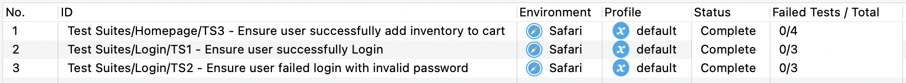

# Sauce Demo Web Automation Test

Tools Used: Katalon

This is automation test for [saucedemo.com](https://www.saucedemo.com)

# Setting up and running tests

* Open project on Katalon Studio
* In this repository, there are several test cases that divided on several test suite files:
    * TS1 - Ensure user successfully login
    * TS2 - Ensure user failed login with invalid password
    * TS3 - Ensure user successfully add inventory to cart
* You can run this testing by Open Test Suite Collection with name Run All Test, and execute it
* After run this automation test, you can see generated report file (HTML) on:
```
{YourProjectPath}/Reports/{Timestamp}/{TestSuiteFileDirectory}
```

# Test Result Summary


